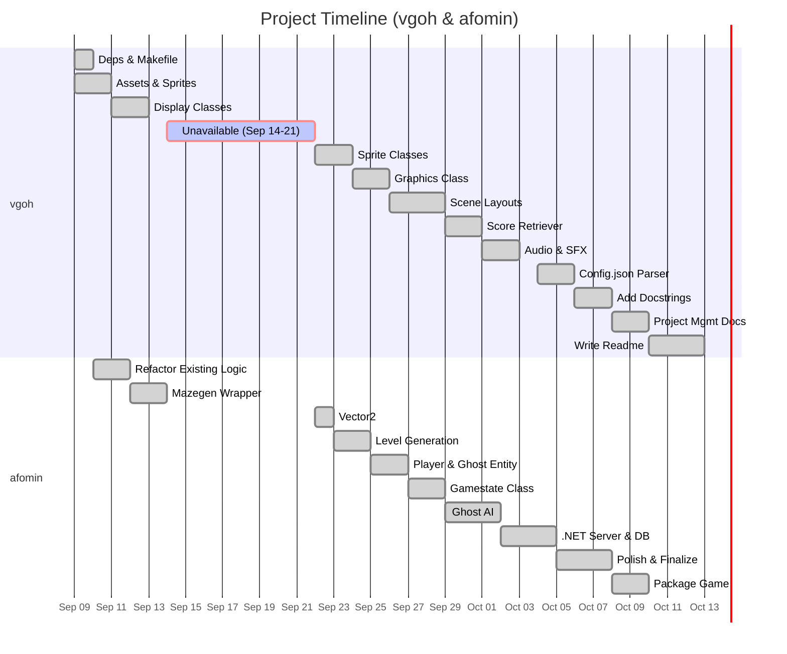

*This project has been created as part of the 42 curriculum by afomin, vgoh.*

# Pac-Man

## Description

42 Pac-Man is a project to recreate the popular game in Python, using object-oriented programming, a simple graphical library (pygame in our case), and a modular, reusable architecture. 

It supports:
*  A custom configuration via a file (JSON with comments) to set game parameters.
*  Level generation based on an external ‘A-Maze-ing‘ package provided by our peers.
*  A high-score system 
*  A polished graphical UI with main menu, game view, and game-over handling.
*  A cheat mode for evaluation purposes.
*  Deployment to a public gaming platform (Itch.io) for demonstration.  [Click here to view](https://gr0k.itch.io/42-pac-man) (Password: 42kl).

### Highscore

### Maze Generation

### Implementation

## Instructions

A Makefile has been provided for convenience. You may choose to run the following commands:

```bash
make install       # Installs the dependencies required
make run           # Runs the game
make debug         # Debugs the program with python debugger
make lint          # Runs mypy and flake8 linting tests
make lint-strict   # Runs mypy with the --strict flag and flake8
make clean         # Removes all build files
```

Otherwise, if you would like to run the program manually, you may follow the steps below:
1. Install the dependencies with `uv sync`.
2. Run the program with `uv run pac-man.py config.json`.

### Configuration

### General Software Architecture

```mermaid
%% Generated by https://gitdiagram.com/vinsongqj/42_pac-man
flowchart TD

subgraph group_client_entry["Client startup"]
  node_launcher["Game launcher<br/>[pac-man.py]"]
  node_config["Configuration<br/>[config_parser.py]"]
  node_scores["High-score client<br/>[scores.py]"]
end

subgraph group_gameplay["Gameplay runtime"]
  node_game_state["Game state<br/>[game.py]"]
  node_actors["Player and ghosts<br/>[entities.py]"]
  node_level["Level generation<br/>[level.py]"]
  node_vectors["Vector math<br/>[vector2.py]"]
  node_graphics["Game graphics<br/>[graphics.py]"]
  node_display["Display primitives<br/>[display.py]"]
  node_audio["Audio playback<br/>[audio.py]"]
end

subgraph group_screens["Scenes and presentation"]
  node_scene_router["Scene router<br/>[scene_utils.py]"]
  node_menu["Menu screen<br/>[menu_scene.py]"]
  node_game_scene["Game screen<br/>[game_scene.py]"]
  node_overlays["Overlays<br/>[overlay.py]"]
  node_end_screens["End screens<br/>[game_over_scene.py]"]
  node_victory["Victory screen<br/>[victory_scene.py]"]
  node_jumpscare["Jumpscare screen<br/>[jumpscare_scene.py]"]
  node_hud["Gameplay HUD<br/>[hud.py]"]
end

subgraph group_score_api["Score service"]
  node_api["HTTP API<br/>[Program.cs]"]
  node_orchestrator["Score orchestration<br/>[Orchestrator.cs]"]
  node_db_manager["User data access<br/>[DbManager.cs]"]
  node_db_context[("Database context<br/>[PacmanDb.cs]")]
  node_user["Score user<br/>[User.cs]"]
end

node_player(("Player"))
node_maze_package["Maze generator package"]

node_player -->|"starts"| node_launcher
node_launcher -->|"loads settings"| node_config
node_launcher -->|"starts scenes"| node_scene_router
node_scene_router -->|"dispatches"| node_menu
node_scene_router -->|"dispatches"| node_game_scene
node_scene_router -->|"dispatches"| node_jumpscare
node_scene_router -->|"dispatches"| node_end_screens
node_scene_router -->|"dispatches"| node_victory
node_menu -->|"reads scores"| node_scores
node_menu -.->|"starts run"| node_game_scene
node_game_scene -->|"updates"| node_game_state
node_game_scene -->|"renders through"| node_graphics
node_game_scene -->|"uses"| node_hud
node_game_state -->|"updates"| node_actors
node_game_state -->|"generates"| node_level
node_actors -->|"checks movement"| node_level
node_actors -->|"uses"| node_vectors
node_game_state -->|"uses"| node_vectors
node_level -.->|"generates maze"| node_maze_package
node_game_state -->|"plays cues"| node_audio
node_graphics -->|"uses primitives"| node_display
node_hud -->|"renders with"| node_display
node_game_scene -->|"plays music"| node_audio
node_game_scene -.->|"opens overlay"| node_overlays
node_end_screens -.->|"submits score"| node_scores
node_victory -->|"uses scores"| node_scores
node_scores -.->|"requests scores"| node_api
node_api -->|"routes operations"| node_orchestrator
node_orchestrator -->|"calls data access"| node_db_manager
node_db_manager -->|"queries and saves"| node_db_context
node_db_manager -->|"creates and reads"| node_user
node_db_context -->|"stores"| node_user

click node_launcher "https://github.com/vinsongqj/42_pac-man/blob/main/pac-man.py"
click node_config "https://github.com/vinsongqj/42_pac-man/blob/main/src/client/config_parser.py"
click node_scene_router "https://github.com/vinsongqj/42_pac-man/blob/main/src/client/scenes/scene_utils.py"
click node_menu "https://github.com/vinsongqj/42_pac-man/blob/main/src/client/scenes/menu_scene.py"
click node_game_scene "https://github.com/vinsongqj/42_pac-man/blob/main/src/client/scenes/game_scene.py"
click node_overlays "https://github.com/vinsongqj/42_pac-man/blob/main/src/client/scenes/overlay.py"
click node_end_screens "https://github.com/vinsongqj/42_pac-man/blob/main/src/client/scenes/game_over_scene.py"
click node_victory "https://github.com/vinsongqj/42_pac-man/blob/main/src/client/scenes/victory_scene.py"
click node_jumpscare "https://github.com/vinsongqj/42_pac-man/blob/main/src/client/scenes/jumpscare_scene.py"
click node_hud "https://github.com/vinsongqj/42_pac-man/blob/main/src/client/scenes/hud.py"
click node_game_state "https://github.com/vinsongqj/42_pac-man/blob/main/src/client/game.py"
click node_actors "https://github.com/vinsongqj/42_pac-man/blob/main/src/client/entities.py"
click node_level "https://github.com/vinsongqj/42_pac-man/blob/main/src/client/level.py"
click node_vectors "https://github.com/vinsongqj/42_pac-man/blob/main/src/client/vector2.py"
click node_graphics "https://github.com/vinsongqj/42_pac-man/blob/main/src/client/graphics.py"
click node_display "https://github.com/vinsongqj/42_pac-man/blob/main/src/client/display.py"
click node_audio "https://github.com/vinsongqj/42_pac-man/blob/main/src/client/audio.py"
click node_scores "https://github.com/vinsongqj/42_pac-man/blob/main/src/client/scores.py"
click node_api "https://github.com/vinsongqj/42_pac-man/blob/main/src/server/Pacman.Server.Api/Program.cs"
click node_orchestrator "https://github.com/vinsongqj/42_pac-man/blob/main/src/server/Pacman.Server.Core/Orchestrator.cs"
click node_db_manager "https://github.com/vinsongqj/42_pac-man/blob/main/src/server/Pacman.Server.Data/DbManager.cs"
click node_db_context "https://github.com/vinsongqj/42_pac-man/blob/main/src/server/Pacman.Server.Data/PacmanDb.cs"
click node_user "https://github.com/vinsongqj/42_pac-man/blob/main/src/server/Pacman.Server.Data/Entities/User.cs"

classDef toneNeutral fill:#f8fafc,stroke:#334155,stroke-width:1.5px,color:#0f172a
classDef toneBlue fill:#dbeafe,stroke:#2563eb,stroke-width:1.5px,color:#172554
classDef toneAmber fill:#fef3c7,stroke:#d97706,stroke-width:1.5px,color:#78350f
classDef toneMint fill:#dcfce7,stroke:#16a34a,stroke-width:1.5px,color:#14532d
classDef toneRose fill:#ffe4e6,stroke:#e11d48,stroke-width:1.5px,color:#881337
classDef toneIndigo fill:#e0e7ff,stroke:#4f46e5,stroke-width:1.5px,color:#312e81
classDef toneTeal fill:#ccfbf1,stroke:#0f766e,stroke-width:1.5px,color:#134e4a
class node_launcher,node_config,node_scores toneBlue
class node_game_state,node_actors,node_level,node_vectors,node_graphics,node_display,node_audio toneAmber
class node_scene_router,node_menu,node_game_scene,node_overlays,node_end_screens,node_victory,node_jumpscare,node_hud toneMint
class node_api,node_orchestrator,node_db_manager,node_db_context,node_user toneRose
class node_player,node_maze_package toneIndigo
```


## Project Management

## Resources

* [Original Pac-Man gameplay](https://youtu.be/dScq4P5gn4A)
* [Piskel (Used to design the sprites)](https://www.piskelapp.com/)
* [ArjanCodes - Composition is Better Than Inheritance in Python](https://youtu.be/0mcP8ZpUR38?si=d0Ay_6RgBRj8pwXq)
* [Clear Code - The ultimate introduction to Pygame](https://youtu.be/AY9MnQ4x3zk?si=hezv1FgP2Fz5Nanf)
* [The Sounds Resource - Pac-Man SFX](https://sounds.spriters-resource.com/arcade/pacman/asset/404131/)


## Disclosure of AI Usage
Claude was used to learn more in-depth Object-Oriented Programming implementation like composition to further improve the structure of the project. It was also used for error handling, finding edge cases and creating boilerplate structure to further improve upon. Gemini was used for simple tasks like docstrings.
