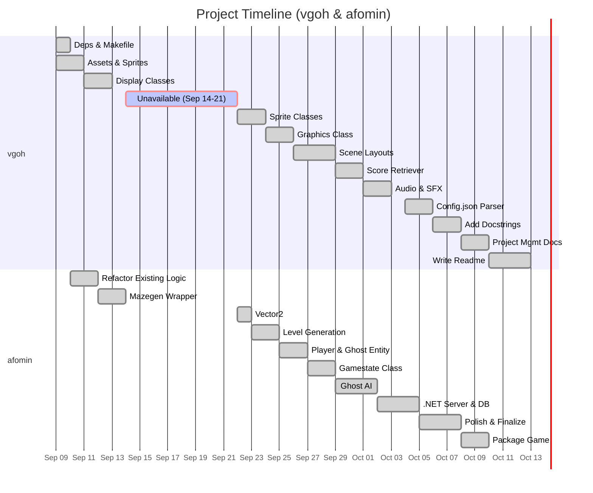
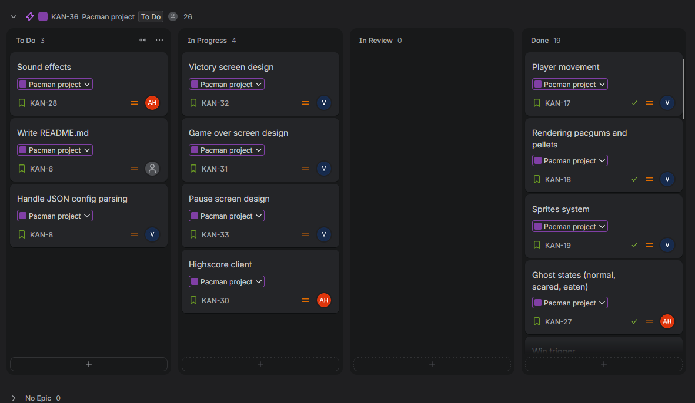

# Gantt chart

```mermaid
%%{init: {'theme': 'default'}}%%
gantt
    title Project Timeline (vgoh & afomin)
    dateFormat  YYYY-MM-DD
    axisFormat  %b %d

    section vgoh
    Deps & Makefile             :done, vg1, 2026-09-09, 1d
    Assets & Sprites            :done, vg2, 2026-09-09, 2d
    Display Classes             :done, vg3, 2026-09-11, 2d
    Unavailable (Sep 14-21)     :crit, active, unav, 2026-09-14, 8d
    Sprite Classes              :done, vg4, 2026-09-22, 2d
    Graphics Class              :done, vg5, 2026-09-24, 2d
    Scene Layouts               :done, vg6, 2026-09-26, 3d
    Score Retriever             :done, vg7, 2026-09-29, 2d
    Audio & SFX                 :done, vg8, 2026-10-01, 2d
    Config.json Parser          :done, vg9, 2026-10-04, 2d
    Add Docstrings              :done, vg10, 2026-10-06, 2d
    Project Mgmt Docs           :done, vg11, 2026-10-08, 2d
    Write Readme                :done, vg12, 2026-10-10, 3d

    section afomin
    Refactor Existing Logic     :done, af1, 2026-09-10, 2d
    Mazegen Wrapper             :done, af2, 2026-09-12, 2d
    Vector2                     :done, af3, 2026-09-22, 1d
    Level Generation            :done, af4, 2026-09-23, 2d
    Player & Ghost Entity       :done, af5, 2026-09-25, 2d
    Gamestate Class             :done, af6, 2026-09-27, 2d
    Ghost AI                    :done, af7, 2026-09-29, 3d
    .NET Server & DB            :done, af8, 2026-10-02, 3d
    Polish & Finalize           :done, af9, 2026-10-05, 3d
    Package Game                :done, af10, 2026-10-08, 2d
```

# Kanban Board (Jira)

